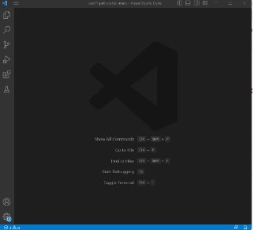
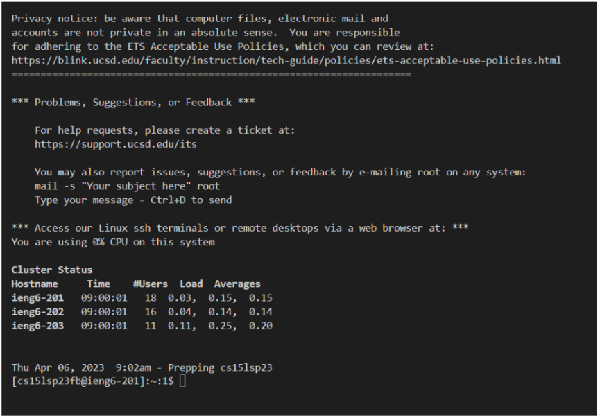

# Lab Report 1:Remote Access and FileSystem

**Step 1:** The first step of this lab after meeting your labmates was to change your course-specific account password for CSE15 at:
[https://sdacs.ucsd.edu/~icc/index.php]([http://a.com](https://sdacs.ucsd.edu/~icc/index.php.))

To log in simply use your UCSD email and your ID number as your password. 

From here click the CSE15 option to change your course-specific password.

After this simply press the Global Password change tool and follow the instructions to change your password. 

**Step 2:** Next, Install VS code on your computer if it is not already installed. To do this go to this website: [https://code.visualstudio.com/](https://code.visualstudio.com/). and simply click the download button. (Note: remember to change the version depending on your OS)

Once downloaded VS code should look like this: 

**Step 3 Part A (For Windows):** If you have a PC then follow these steps: 
1. Open VS code and then open the terminal using “ctrl” + “`”
2. Then open the command-line pallet using “ctrl” + “shift” + “P”
3. Type in “Select Default Profile” in the search bar 
4. Click the “+” icon on the terminal window 

The new terminal will now be a Git Bash terminal 

**Step 3 Part B:** Now to remotely connect to your course-specific account first use: 

$ ssh cs15lwi23xx@ieng6.ucsd.edu

(Remember not to type in/copy the $ as it is already present in the terminal) 

Replace the xx with the two letters at the end of your course-specific account, for example, fb in the image shown in Step 1. 

Since this is most likely the first time you have tried to connect to this server, the terminal will present you with the following message: 

ssh cs15lwi23fb@ieng6.ucsd.edu The authenticity of host 'ieng6.ucsd.edu (128.54.70.227)' can't be established. RSA key fingerprint is SHA256:ksruYwhnYH+sySHnHAtLUHngrPEyZTDl/1x99wUQcec. Are you sure you want to continue connecting (yes/no/[fingerprint])?

Type “yes” to continue 

After writing yes, it will give you a prompt to type in your password. Here you should type in the password you set as your course-specific password. (Note: While typing, no characters or * will appear on the screen, however, you are still typing so make sure you type it correctly.) 

Once you have typed in the password correctly and pressed enter the message below should appear, establishing your connection to the server. 

If the above message does not appear and instead a new “password:” appears on the next command line, you have typed in the password wrong. You have 5 attempts before you must restart step 3 B from ssh… 

If instead, you get an error message that the connection could not be established, there is probably an error on the server’s end and you will just have to wait it out and try again later. 

**Step 4:** Now you can try commands:
For example:
- cd ~
- cd
- ls -lat
- ls -a
- ls <directory> where <directory> is /home/linux/ieng6/cs15lsp23/cs15lsp23abc, where the abc is one of the other group members’ username
- cp /home/linux/ieng6/cs15lsp23/public/hello.txt ~/
- cat /home/linux/ieng6/cs15lsp23/public/hello.txt

Bellow is my correct implementation of these commands: 
  

  
Note that while implementing, /home/linux/ieng6/cs15lsp23/cs15lsp23abc, where the abc is one of the other group member’s username, my result was permission denied. This is because I do not have access to the files on my group member’s account. 

This concludes this Lab and you can log out of the remote server using “Ctrl”+ “D”
__________________________________________________________________

