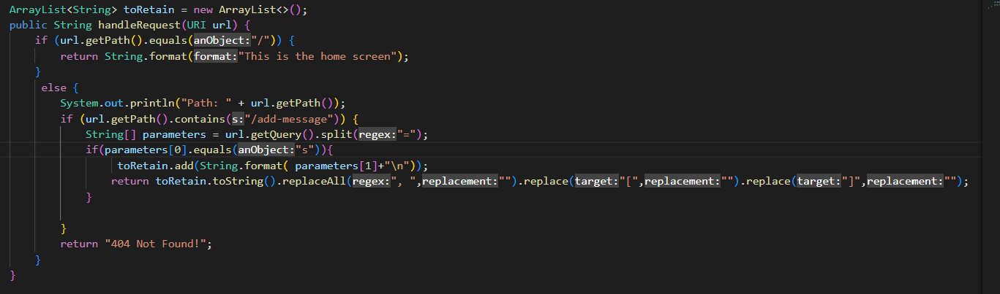

# Lab Report 2: Servers and Bugs 

**The following is the code for StringServer**

class Handler implements URLHandler {
    ArrayList<String> toRetain = new ArrayList<>();
    public String handleRequest(URI url) {
        if (url.getPath().equals("/")) {
            return String.format("This is the home screen");
        } 
         else {
            System.out.println("Path: " + url.getPath());
            if (url.getPath().contains("/add-message")) {
                String[] parameters = url.getQuery().split("=");
                if(parameters[0].equals("s")){  
                     toRetain.add(String.format( parameters[1]+"\n"));
                    return toRetain.toString().replaceAll(", ","").replace("[","").replace("]","");
                }
                
            }
            return "404 Not Found!";
        }
    }
}

**This is how it looks when I add one word to the local server**

The back end of what happens when one word is added to the url using /add-message?s=<stting> can be summed up in a few steps: 
  1. First, the class StringServer calls the Handeler class (This is the class shown above)
  2. Then the Handler checks the url for the following query:"/add-message" 
  3. If the url is typed in correctly, i.e. /add-message?s=<stting>, then the string after the "=" is added to the ArrayList toRetain. Else the program will return a 404 error
  4. Finally using the .toString() method, the string array is turned into a string and the brackets "[" & "]" are replaced with empty spaces using the .replace() method
  
  **This is how it looks when I add two words to the local server**
  
  
  
  The back end of what happenes when two words are added is largely the same as when just one was added: 
  1. First, the class StringServer calls the Handeler class (This is the class shown above)
  2. Then the Handler checks the url for the following query:"/add-message" 
  3. Again if the url is typed correctly the string after the "=" is added to the ArrayList toRetain. 
  4. Ulike previously, however, because the ArrayList is not a method local variable it "remembers" the string that was entered previously. Because of this when using the .toString() method, the string array contains two elements. Here both the .replace() methods are used on the brackets as well as the .replaceAll() method on the comma(s).
  
  
  
  
