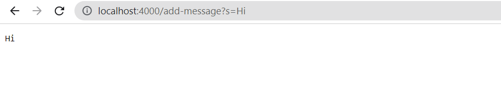
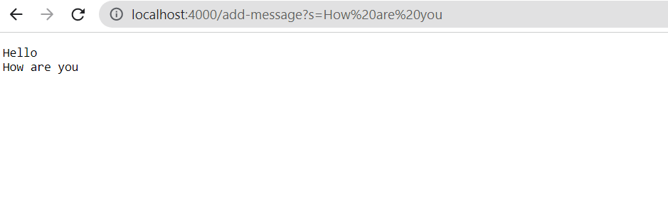
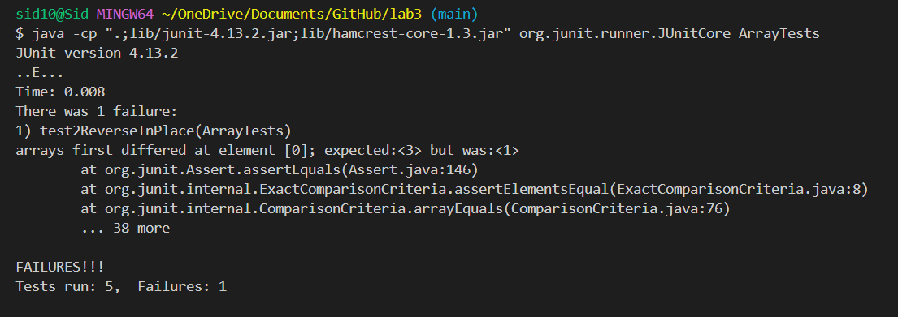

# Lab Report 2: Servers and Bugs 

## Part 1

**The following is the code for StringServer**


```
class Handler implements URLHandler {
    ArrayList<String> toRetain = new ArrayList<>();
    public String handleRequest(URI url) {
        if (url.getPath().equals("/")) {
            return String.format("This is the home screen");
        } 
         else {
            System.out.println("Path: " + url.getPath());
            if (url.getPath().contains("/add-message")) {
                String[] parameters = url.getQuery().split("=");
                if(parameters[0].equals("s")){  
                     toRetain.add(String.format( parameters[1]+"\n"));
                    return toRetain.toString().replaceAll(", ","").replace("[","").replace("]","");
                }
                
            }
            return "404 Not Found!";
        }
    }
}

class StringServer {
    public static void main(String[] args) throws IOException {
        if(args.length == 0){
            System.out.println("Missing port number! Try any number between 1024 to 49151");
            return;
        }

        int port = Integer.parseInt(args[0]);

        Server.start(port, new Handler());
    }
}
```

  
  <br>

**This is how it looks when I add one word to the local server**



The back end of what happens when one word is added to the url using /add-message?s=<stting> can be summed up in a few steps: 
  1. First, the class StringServer calls the Handeler class 
  2. Then the Handler checks the url for the following query:"/add-message" 
  3. If the url is typed in correctly, i.e. /add-message?s=<stting>, then the string after the "=" is added to the ArrayList toRetain. Else the program will return a 404 error
  4. Finally using the .toString() method, the string array is turned into a string and the brackets "[" & "]" are replaced with empty spaces using the .replace() method  
    <br>
  
  **This is how it looks when I add two words to the local server**
  
  
  
  The back end of what happenes when two words are added is largely the same as when just one was added: 
  1. First, the class StringServer calls the Handeler class 
  2. Then the Handler checks the url for the following query:"/add-message" 
  3. Again if the url is typed correctly the string after the "=" is added to the ArrayList toRetain. 
  4. Ulike previously, however, because the ArrayList is not a method local variable it "remembers" the string that was entered previously. Because of this when using the .toString() method, the string array contains two elements. Here both the .replace() methods are used on the brackets as well as the .replaceAll() method on the comma(s).
    
  ## Part 2
    
 **The following is a failure iducing input for the reverseInPlace() method:**
   
    
    ```
    @Test
    public void test2ReverseInPlace(){
         int[] test1 = {1,2,3};
         ArrayExamples.reverseInPlace(test1);
         assertArrayEquals(new int[]{ 3,2,1 }, test1);
        }
    ```
    
	
  **The following input does not induce a failure:**
    
    ```
    @Test 
	public void testReverseInPlace() {
    int[] input1 = { 3 };
    ArrayExamples.reverseInPlace(input1);
    assertArrayEquals(new int[]{ 3 }, input1);
	}
    ```
    
  **The following is a symptom:**
    
  
    
  **This is the code before debugging:**
	
    
    ```
    static void reverseInPlace(int[] arr) {
    for(int i = 0; i < arr.length; i += 1) {
      int temp = arr[i];
      arr[i] = arr[arr.length - i - 1];
      arr[arr.length - i - 1] = temp;
        }
     }
	```

				  
**This is the code after debugging:**
				  
```
    static void reverseInPlace(int[] arr) {
    for(int i = 0; i < arr.length/2; i += 1) {
      int temp = arr[i];
      arr[i] = arr[arr.length - i - 1];
      arr[arr.length - i - 1] = temp;
    }
  }
```

Deviding the arr.length by 2 fixes the code as it only needs to run on half the array length to swap the end with the beginning. Without this "/2" the swaps are done twice and therefore the resulting array is the same as the original.
	
## Part 3
  Probably the most shocking thing that I learned from the Labs was that a method can use an interface wihout actually implementing one by creating a new object of the necessary class and then using an interface method inside the original. I learned this through the help of my TA and peers while attempting ListTests.java. Additionally, I also learned how to use and interact with my local and school server while understanding NumberServer.java.  	

 
