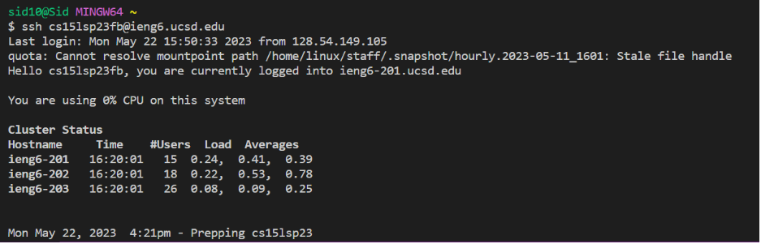
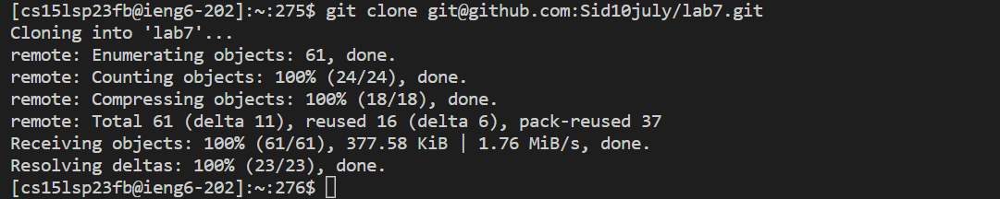
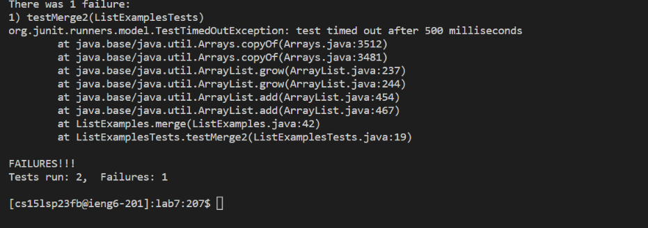
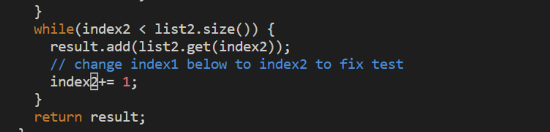
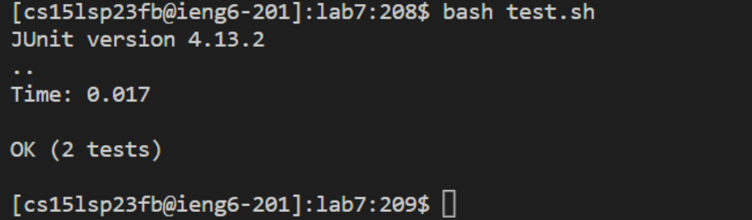
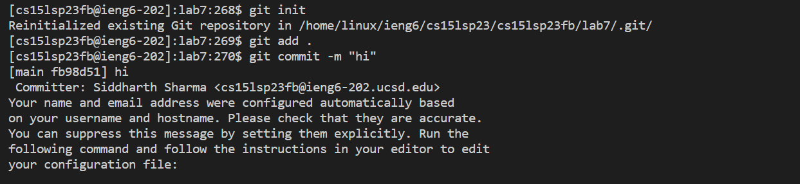
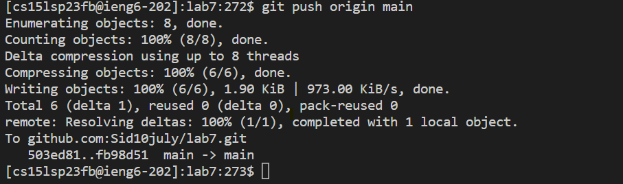

# Lab Report 4: Vim Commands 

**Step 4:** `ssh cs15lsp23fb@ieng6.ucsd.edu` &lt;Enter&gt; 

In this step I logged into my .ieng account.
  
**Step 5:** `git clone git@github.com:Sid10july/lab7.git` &lt;Enter&gt;
  

  
In this step I cloned the fork of my repository. 
  
**Step 6:** `cd lab7` &lt;Enter&gt; `Bash test.sh `&lt;Enter&gt;
 
  
  
In this step I change the directory to lab7 and then ran the tests using bash test.sh to demonstrate that it fails.
  
**Step 7:** `vim ListExamples.java` &lt;Enter&gt; &lt;43G&gt; &lt;e&gt; &lt;dw&gt; &lt;i&gt; &lt;2&gt; &lt;esc&gt; &lt;:wq&gt; &lt;Enter&gt;
  
  
  
In this step I first use vim to enter the ListExamples.java file. Afterwards I use 43 Shift-g to go to the 43 line, then use e to go to the end of the word index1, dw to delete 1, i to go to insert mode, 2 to replace the 1 I removed, and finally use :wq to save the changes after using esc to get out of insert mode.

**Step8:** `Bash test.sh` &lt;Enter&gt;

In this step I ran the tests again to demonstrate that I have fixed the problem.

**Step9:** `Git init` &lt;Enter&gt;  `Git add .` &lt;Enter&gt;   `Git commit -m “committing all the files in this directory”` &lt;Enter&gt; `git push origin main ` &lt;Enter&gt;

In this step I first commited and then pushed the resulting change to my Ghithub account. To commit I first reinitilizing git using Git init, then adding all the files in the current directory using Git add ., and finally committed using Git commit - m "comment". Then to push I used the git push origin main command. 

  
