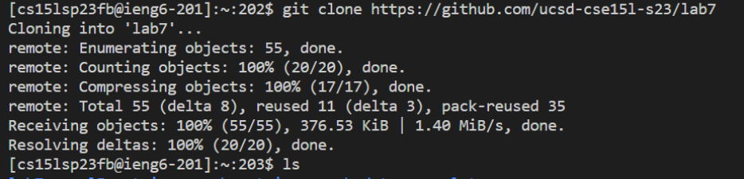

# Lab Report 4: Vim Commands 

**Step 4:** ssh cs15lsp23fb@ieng6.ucsd.edu <Enter> 

  In this step I logged into my .eng account.
  
**Step 5:** git clone https://github.com/ucsd-cse15l-s23/lab7 <Enter>
  
  In this step I cloned the fork of my repository 
  
