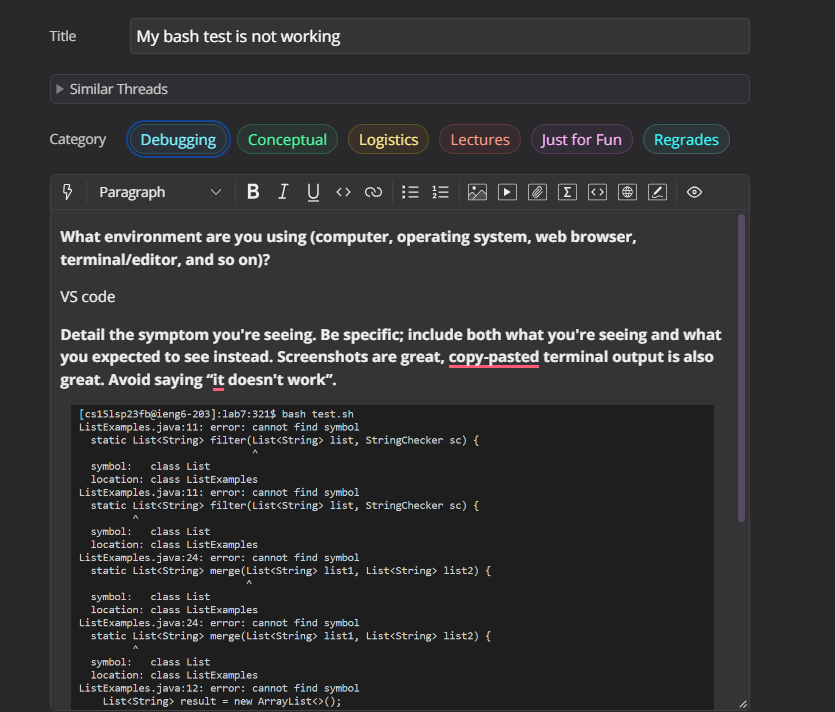
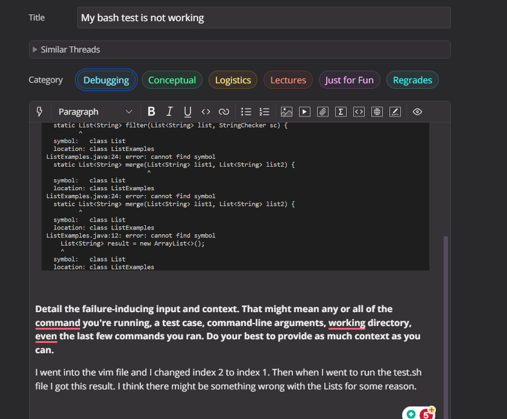
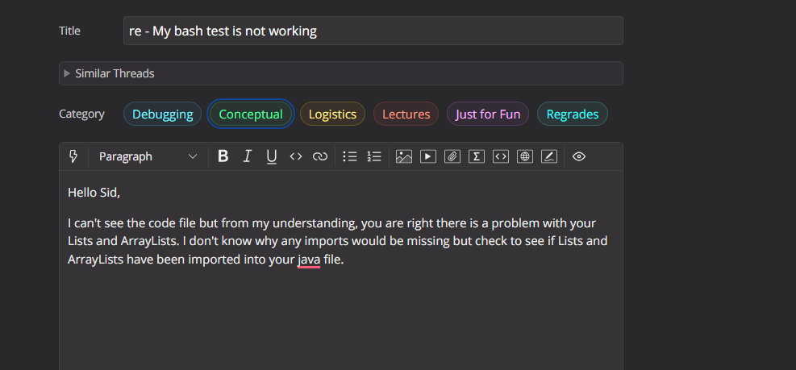
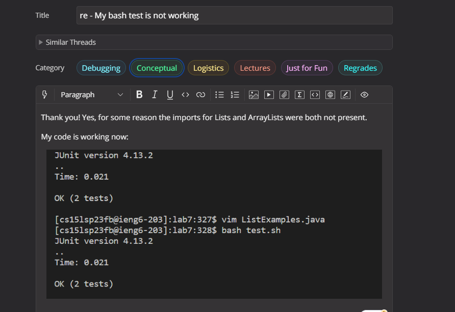
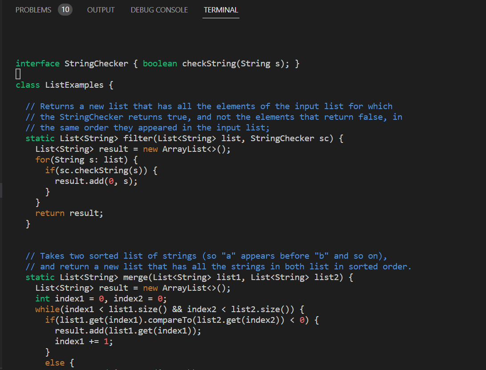
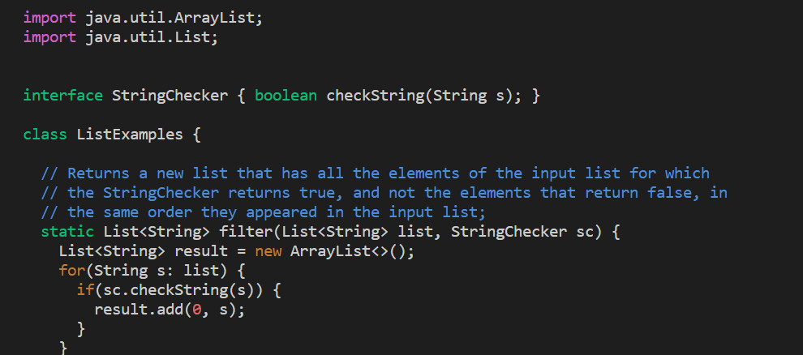

# Lab Report 5: Debugging Scenario
## Part 1
The Question: 
  

The TAs response: 

  

The Resolution: 

  
  

## Info about the setup
Code before: 
  
 
 
 Code After: 
    

I used my clone of the Lab 7 repository to write this Lab.The file and directory strcture that was used in this mock debugging scenario can be found at the following link: https://github.com/ucsd-cse15l-s23/lab7. And if it wasn't already evident, to setup this mock scenario I just removed the imports from the ListExamples.java file. The exact command line commands were: 
`vim ListExamples.java`  &lt;Enter&gt;
 &lt;j&gt; &lt;i&gt;  &lt;2dd&gt;  &lt;esc&gt; &lt;:wq&gt;. To fix the code I simply had to re-enter the import commands.

## Part 2
The most interesting thing I learned after the second half of this course was understanding when and how to use Vim commands. Prior to this course, I had never heard of Vim, but after learning about its uses in editing java files directly form the terminal intrigued me. One aspect that fasinated and also frusterated me was the modal editing mode of Vim.  Overall, delving into the world of Vim and its commands has significantly improved my text editing capabilities and i'm glad to have learned it during the course.

  
